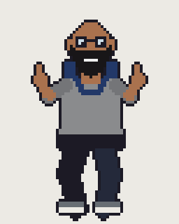

# Week 3 — Arrays and Loops

Eight dance poses in one array, a loop that loads them, and a few dancers animating at different speeds.

- **[index.html](index.html) + [sketch.js](sketch.js)**: the finished in-class sketch.
- **[dance_starter.zip](dance_starter.zip)**: where we started in class: one image, plus the steps as comments.
- **[dance_frames/](dance_frames/)**: the eight poses, `dance0.png` to `dance7.png`.
- **[dance_spritesheet.png](dance_spritesheet.png)**: all eight poses in one image.
- **[sketch-functions.js](sketch-functions.js)**: the same sketch written with functions. We'll get to functions later.

Open the folder with Live Server. Opening `index.html` straight from disk won't work, because the browser blocks image loading.

Lab: [Lab03 — Make the Dancers Yours](https://github.com/IAT-806/Lab03)
